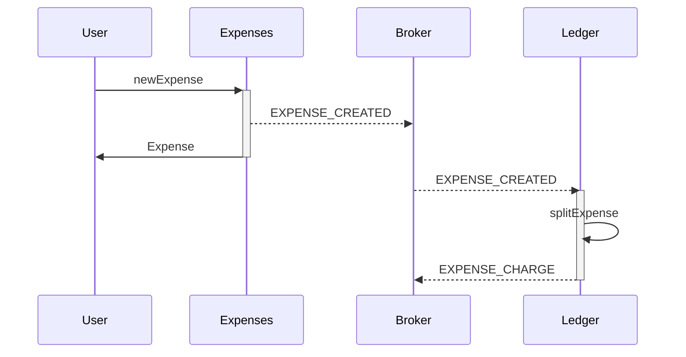

# expense-app-v3

```mermaid
sequenceDiagram
    User ->>+ Expenses: newExpense
    Expenses -->> Broker: EXPENSE_CREATED
    Expenses ->>- User: Expense
    Broker -->> Ledger: EXPENSE_CREATED
    activate Ledger
    Ledger ->> Ledger: splitExpense
    Ledger -->> Broker: EXPENSE_CHARGE
    deactivate Ledger
```