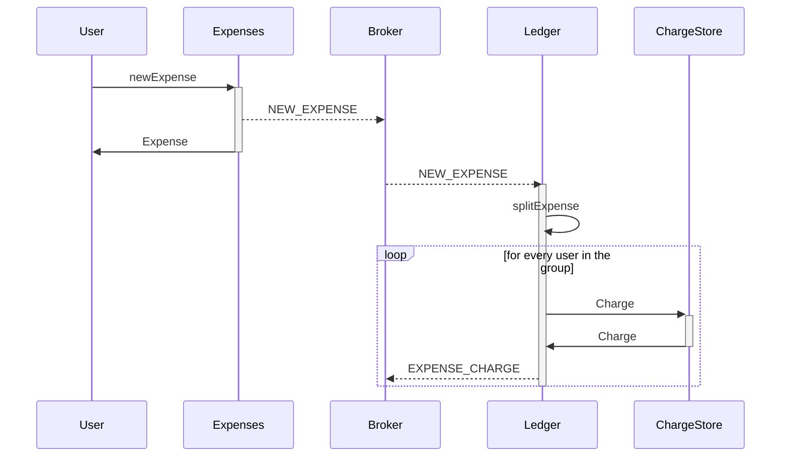
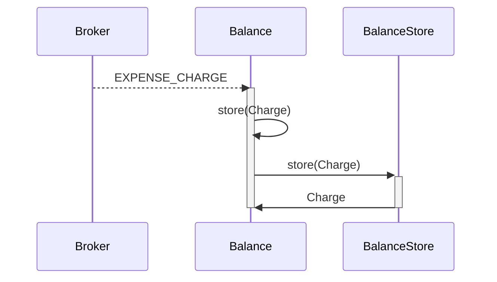
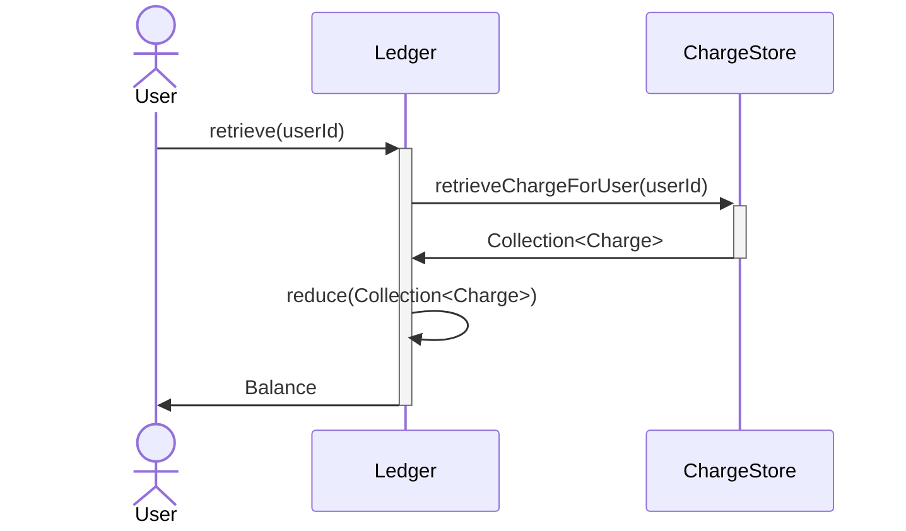
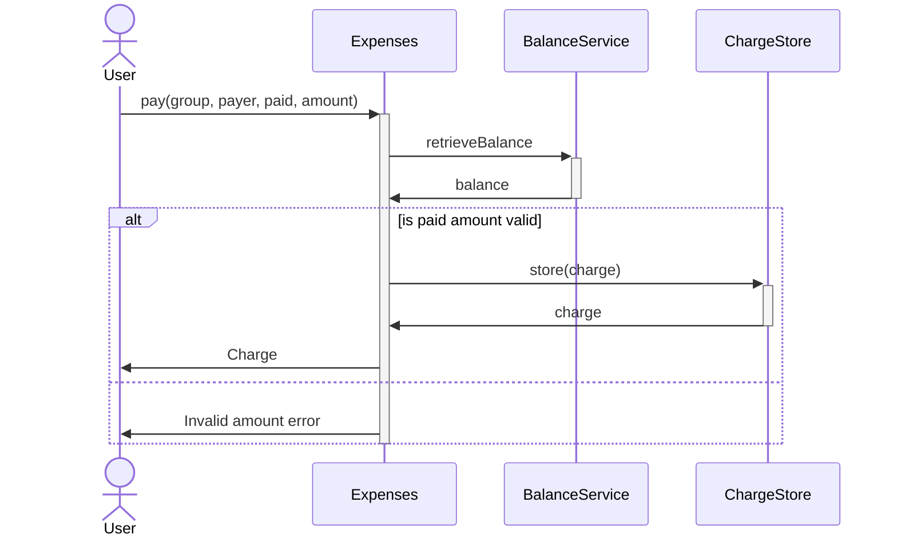

# expenses-app
This is a sample project developed mainly to allow me to make practice with hexagonal architecture, cucumber tests and reactive programming. 

The implemented application is inspired by [SplitWisea](https://www.splitwise.com/), which I use and love, so for my practice project I chose to implement a subset of splitwise functionalities. 
The main feature implemented are: 
- Create groups to share expenses
- Create and split expenses 
- Retrieve a user balance for the whole group or regarding a single user 
- Pay the user debts 

# Table Of Contents
- [How to run the application](#how-to-run-the-application)
- [How to test](#how-to-test)
- [Use Cases](#use-cases)
    * [Add New Expense Use Case](#add-new-expense-use-case)
    * [Update Balance Use Case ](#update-balance-use-case)
    * [Retrieve Balance Use Case](#retrieve-balance-use-case)
    * [Pay ](#pay)
# How to run the application
The application is developed by using Spring Boot, therefore you can run it as any other spring boot app, just take care to choose the appropriate profile from the ones listed below.
The container is the module expenses-app, that will generate the executable jar to spin up the application.
## Spring Profiles
### Local
An H2 in-memory database is used and no message broker is required
### Dev
An H2 in-memory database is used and rabbitmq is used as message broker
# How to test
the application has a suite of unit and integration tests. The integration tests are under expenses-app and they are independent of the actual implementation of the port modules as they do not rely on any kind of hard wired mock. 

A set of end-to-end test is implemented with the collection postman located under the folder "Postman Collection"
# Use Cases
The following sequence diagrams represent a high level view on the main functionalities of the application. 
## Add New Expense Use Case

## Update Balance Use Case 

## Retrieve Balance Use Case

## Pay 

