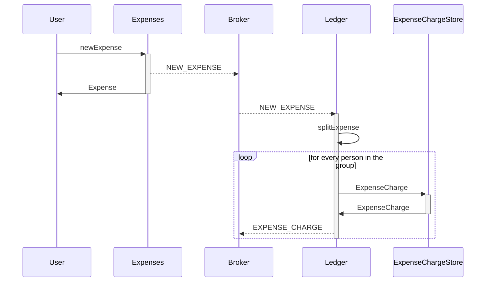
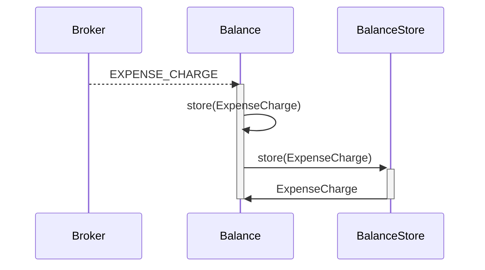
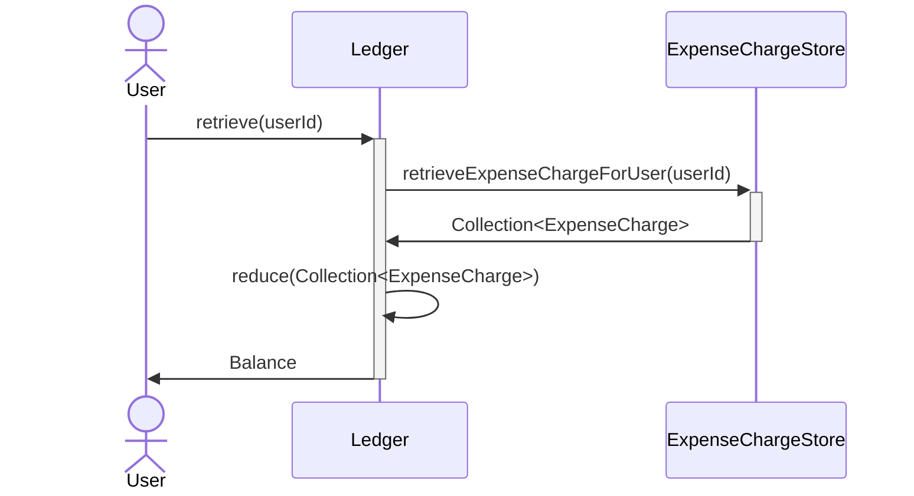
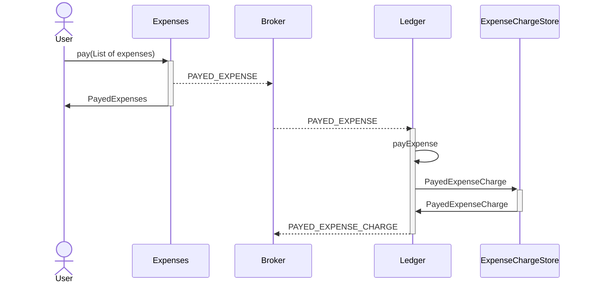

# expense-app-v3
# Use Cases
## Add New Expense Use Case

```mermaid
sequenceDiagram
    User ->>+ Expenses: newExpense
    Expenses -->> Broker: NEW_EXPENSE
    Expenses ->>- User: Expense
    Broker -->> Ledger: NEW_EXPENSE
    activate Ledger
    Ledger ->> Ledger: splitExpense
    loop for every person in the group
        Ledger ->>+ ExpenseChargeStore: ExpenseCharge
        ExpenseChargeStore ->>- Ledger: ExpenseCharge
        Ledger -->> Broker: EXPENSE_CHARGE
    end
    deactivate Ledger
```
## Update Balance Use Case 

```mermaid
sequenceDiagram
    Broker -->> Balance: EXPENSE_CHARGE
    activate Balance
    Balance ->> Balance: store(ExpenseCharge)
    Balance ->>+ BalanceStore: store(ExpenseCharge)
    BalanceStore ->>- Balance: ExpenseCharge
    deactivate Balance
```
## Retrieve Balance Use Case

```mermaid
sequenceDiagram
    actor User
    User ->>+ Ledger: retrieve(userId)
    Ledger ->>+ ExpenseChargeStore: retrieveExpenseChargeForUser(userId)
    ExpenseChargeStore ->>- Ledger: Collection<ExpenseCharge>
    Ledger ->> Ledger: reduce(Collection<ExpenseCharge>)
    Ledger ->>- User: Balance
```

## Pay Expense

```mermaid
sequenceDiagram
    actor User
    User ->>+ Expenses: pay(List of expenses)
    Expenses -->> Broker: PAYED_EXPENSE
    Expenses ->>- User: PayedExpenses
    Broker -->> Ledger: PAYED_EXPENSE
    activate Ledger
    Ledger ->> Ledger: payExpense
    Ledger ->>+ ExpenseChargeStore: PayedExpenseCharge
    ExpenseChargeStore ->>- Ledger: PayedExpenseCharge
    Ledger -->> Broker: PAYED_EXPENSE_CHARGE
    deactivate Ledger
```